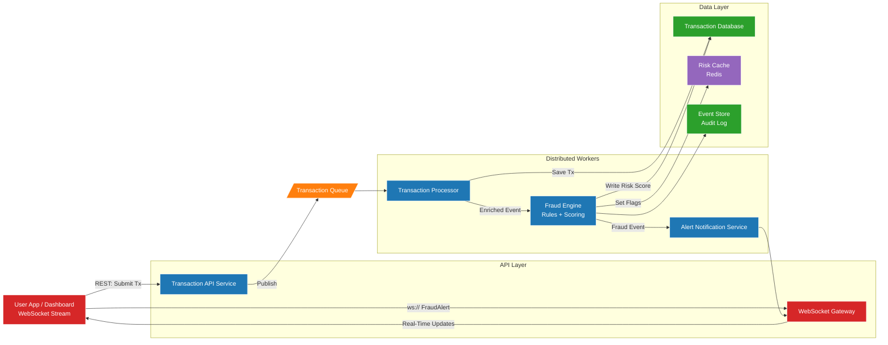

# 🛡️ Real-Time Transaction Monitoring & Fraud Detection

> A distributed fraud detection platform built with **Go**, simulating how real fintech systems catch fraud before money moves.

---

## What This Is

Most fraud detection tutorials show you a single function with an if-statement. This project shows the full picture from the moment a transaction hits the API, through an async worker queue, into a multi-layer fraud engine, and back to a live dashboard via WebSocket.

Built as a proof of concept for how platforms like Wave, MTN MoMo, or any payments company would architect this at scale.

---

## How It Works

```
POST /payments
      │
      ▼
  API Service ──► Queue ──► Worker
                                │
                                ▼
                          Fraud Engine
                         ┌──────────────────────────────┐
                         │ Layer 1: Rules & Sanctions    │
                         │ Layer 2: Velocity / History   │
                         │ Layer 3: ML Probability Score │
                         └──────────────────────────────┘
                                │
                    ┌───────────┴───────────┐
                    ▼                       ▼
               PostgreSQL             Redis Pub/Sub
                    │                       │
                    │                  WebSocket Hub
                    │                       │
                    └───────────┬───────────┘
                                ▼
                         Live Dashboard
```

A transaction starts as `QUEUED`, the worker processes it asynchronously, the fraud engine scores it, and the final status (`APPROVED`, `FLAGGED`, or `DECLINED`) is written to the database. If fraud is detected, a `FraudAlert` is published to Redis and pushed instantly to the dashboard over WebSocket.

---

## Fraud Engine Layers

| Layer | Type | How It Works |
|---|---|---|
| **Layer 1** | Rules & Sanctions | Hard IF/THEN logic. Checks watchlists, sanctions lists, and known patterns. Fast and transparent. |
| **Layer 2** | Velocity / Behavioral | Tracks spending history. Flags unusual bursts of activity within a time window. |
| **Layer 3** | ML / Probabilistic | Statistical model scoring likelihood of fraud. Catches patterns no rule ever anticipated. |

**Risk Score Thresholds**

| Score | Status | Meaning |
|---|---|---|
| < 0.6 | `APPROVED` | Clean transaction |
| > 0.6 | `FLAGGED` | Suspicious — needs review |
| >= 0.8 | `DECLINED` | High confidence fraud — blocked |

---

## Tech Stack

- **Go** — API server, worker, fraud engine
- **Echo** — HTTP framework
- **PostgreSQL** — transaction storage
- **Beanstalkd** — job queue
- **Redis** — pub/sub for fraud events, velocity cache
- **WebSockets** — real-time alert delivery
- **Docker + Make** — local development

---

## Architecture Diagram



---

## Getting Started

### Prerequisites

- [Docker](https://docs.docker.com/get-docker/) and Docker Compose
- [Make](https://www.gnu.org/software/make/)

### 1. Clone

```bash
git clone https://github.com/Ngang-muma-musa/transaction-monitoring-and-fraud-detection-poc
cd transaction-monitoring-and-fraud-detection-poc
```

### 2. Configure environment

```bash
cp .env.example .env
```

Open `.env` and fill in your database credentials, Redis auth, and any other service config.

### 3. Build

```bash
make build
```

### 4. Run migrations

```bash
make migrate/up
```

### 5. Start all services

```bash
make up
```

### 6. Open the dashboard

```
http://localhost:8080
```

The dashboard auto-connects to the WebSocket and loads all existing transactions on startup.

### Other commands

| Command | Description |
|---|---|
| `make logs` | Tail logs for all services |
| `make down` | Stop and remove all containers |
| `make redis/cli` | Open a Redis CLI session |
| `make migrate/down` | Roll back the last migration |
| `make migrate/new` | Create a new migration file |
| `make help` | List all available commands |

---

## API Reference

Base URL: `http://localhost:8080`

### GET /health
```bash
curl http://localhost:8080/health
# {"status":"OK"}
```

---

### POST /payments

Submit a transaction for processing.

```bash
curl -X POST http://localhost:8080/payments \
  -H "Content-Type: application/json" \
  -d '{
    "user_id": "8e88458e-3b73-46c5-ae2a-3f4ab457bd6c",
    "amount": 7000,
    "currency": "EUR"
  }'
```

**Request fields**

| Field | Type | Description |
|---|---|---|
| `user_id` | string (UUID) | User initiating the transaction |
| `amount` | float64 | Transaction amount |
| `currency` | string | ISO 4217 code — e.g. `XAF`, `USD`, `EUR` |

**Response** `201 Created`
```json
{
  "id": "ee5486de-f5ad-40d3-8181-a3f4ab457bd6",
  "user_id": "8e88458e-3b73-46c5-ae2a-3f4ab457bd6c",
  "amount": 7000,
  "currency": "EUR",
  "status": "QUEUED",
  "created_at": "2024-01-15T00:03:36Z"
}
```

---

### GET /payments

Fetch all transactions, newest first.

```bash
curl http://localhost:8080/payments
```

---

### GET /payments/:id

Fetch a single transaction by ID.

```bash
curl http://localhost:8080/payments/ee5486de-f5ad-40d3-8181-a3f4ab457bd6
```

---

### WebSocket — ws://localhost:9000/ws

Connect to receive real-time `FraudAlert` events.

```js
const ws = new WebSocket('ws://localhost:9000/ws');

ws.onmessage = (event) => {
  const alert = JSON.parse(event.data);
  // { transaction_id, risk_score, reason }
};
```

**FraudAlert shape**

```json
{
  "transaction_id": "ee5486de-f5ad-40d3-8181-a3f4ab457bd6",
  "risk_score": 0.8,
  "reason": "high_value_foreign_currency, velocity_exceeded"
}
```

**Reason values**

| Reason | Layer | Trigger |
|---|---|---|
| `high_value_foreign_currency` | Layer 1 | Non-XAF currency with amount > 6000 |
| `velocity_exceeded` | Layer 2 | User spend in last hour > 1000 |
| `ml_anomaly_detected` | Layer 3 | ML probability > 0.4 |

---

## Error Format

```json
{ "message": "error description" }
```

| Code | Meaning |
|---|---|
| `400` | Bad request |
| `404` | Not found |
| `500` | Internal server error |
