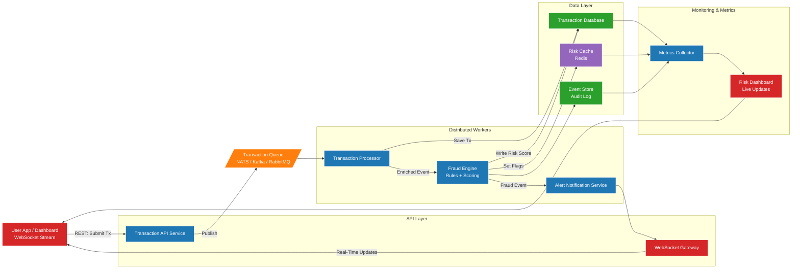

# Real-Time Transaction Monitoring & Fraud Detection Platform

A distributed system built with **Go**, **Redis**, **WebSockets**, and **message queues** to simulate how real fintech platforms detect fraud in real time.

This project demonstrates:

- Real-time transaction ingestion  
- Asynchronous distributed processing  
- Fraud detection (rule-based + scoring)  
- WebSocket live dashboard updates  
- Event-driven architecture  
- Persistent data and audit logs  

---

## 🚀 Features

### 🔹 Real-Time Transaction Processing
Incoming transactions are validated and streamed through a distributed pipeline using queues.

### 🔹 Fraud Detection Engine
The system evaluates each transaction using:
- configurable rules  
- real-time counters  
- device/IP analysis  
- anomaly detection  
- risk scoring

### 🔹 WebSocket Live Updates
Fraud alerts and risk statuses are broadcast to clients instantly.

### 🔹 Redis for Ultra-Fast State
Used for:
- risk cache  
- fraud flags  
- counters  
- rate limiting  

### 🔹 Event Store & Database
Durable logging of:
- transactions  
- fraud events  
- system activity  
- audit trails  

---

## 🏗️ Architecture Diagram

---

## 📁 Project Structure

