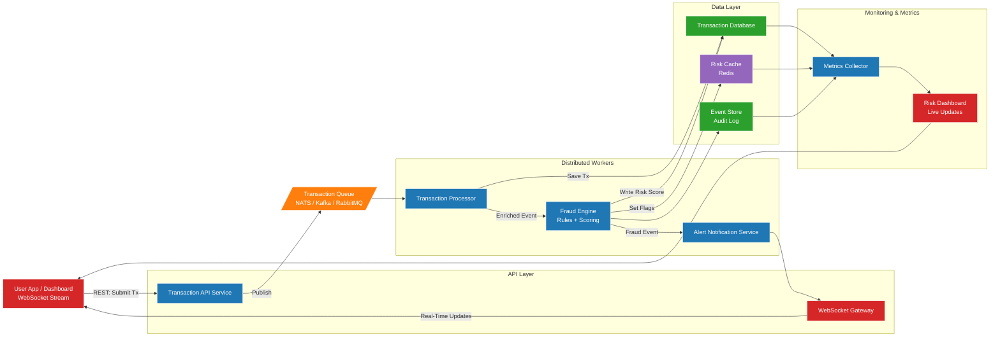

# Real-Time Transaction Monitoring & Fraud Detection Platform

A distributed system built with **Go**, **Redis**, **WebSockets**, and **message queues** to simulate how real fintech platforms detect fraud in real time.

This project demonstrates:

- Real-time transaction ingestion  
- Asynchronous distributed processing  
- Fraud detection (rule-based + scoring)  
- WebSocket live dashboard updates  
- Event-driven architecture  
- Persistent data and audit logs  

---

## 🚀 Features

### 🔹 Real-Time Transaction Processing
Incoming transactions are validated and streamed through a distributed pipeline using queues.

### 🔹 Fraud Detection Engine
The system evaluates each transaction using:
- configurable rules  
- real-time counters  
- device/IP analysis  
- anomaly detection  
- risk scoring

### 🔹 WebSocket Live Updates
Fraud alerts and risk statuses are broadcast to clients instantly.

### 🔹 Redis for Ultra-Fast State
Used for:
- risk cache  
- fraud flags  
- counters  
- rate limiting  

### 🔹 Event Store & Database
Durable logging of:
- transactions  
- fraud events  
- system activity  
- audit trails  

---

## 🏗️ Architecture Diagram



---

# Getting Started

## Prerequisites

- [Docker](https://docs.docker.com/get-docker/) and Docker Compose
- [Make](https://www.gnu.org/software/make/)

---

## 1. Clone the repository

```bash
git clone https://github.com/your-username/your-repo.git
cd your-repo
```

## 2. Configure environment

Copy the example env file and fill in your values:

```bash
cp .env.example .env
```

Open `.env` and update the variables — database credentials, Redis auth, and any other service config.

## 3. Build

```bash
make build
```

## 4. Run migrations

```bash
make migrate/up
```

## 5. Start all services

```bash
make up
```

This starts the API, worker, database, Redis, and all dependencies in the background.

## 6. Open the dashboard

Once the services are up, open your browser and go to:

```
http://localhost:8080
```

The dashboard connects to the WebSocket automatically on load and fetches all existing transactions from `GET /payments`.

---

## Other useful commands

| Command | Description |
|---|---|
| `make logs` | Tail logs for all running services |
| `make down` | Stop and remove all containers |
| `make redis/cli` | Open a Redis CLI session |
| `make migrate/down` | Roll back the last migration |
| `make migrate/new` | Create a new migration file |
| `make help` | Print all available commands |


## API Documentation

Base URL: `http://localhost:8080`

---

## Health

### GET /health

Check if the service is running.

**Response**
```json
{
  "status": "OK"
}
```

---

## Payments

### POST /payments

Submit a new payment transaction for processing. The transaction is queued and processed asynchronously by the fraud engine.

**Request Body**

| Field | Type | Required | Description |
|---|---|---|---|
| `user_id` | string (UUID) | Yes | ID of the user initiating the transaction |
| `amount` | float64 | Yes | Transaction amount |
| `currency` | string | Yes | ISO 4217 currency code (e.g. XAF, USD, EUR) |

**Example Request**
```bash
curl -X POST http://localhost:8080/payments \
  -H "Content-Type: application/json" \
  -d '{
    "user_id": "8e88458e-3b73-46c5-ae2a-3f4ab457bd6c",
    "amount": 7000,
    "currency": "EUR"
  }'
```

**Example Response** `201 Created`
```json
{
  "id": "ee5486de-f5ad-40d3-8181-a3f4ab457bd6",
  "user_id": "8e88458e-3b73-46c5-ae2a-3f4ab457bd6c",
  "amount": 7000,
  "currency": "EUR",
  "status": "QUEUED",
  "created_at": "2024-01-15T00:03:36Z"
}
```

**Transaction Status Flow**

```
QUEUED → (fraud engine runs) → APPROVED | FLAGGED | DECLINED
```

| Status | Condition |
|---|---|
| `QUEUED` | Transaction received and queued for processing |
| `APPROVED` | Risk score below all thresholds |
| `FLAGGED` | Risk score > 0.6 |
| `DECLINED` | Risk score >= 0.8 |

---

### GET /payments

Fetch all transactions, sorted by most recent first.

**Example Request**
```bash
curl http://localhost:8080/payments
```

**Example Response** `200 OK`
```json
[
  {
    "id": "ee5486de-f5ad-40d3-8181-a3f4ab457bd6",
    "user_id": "8e88458e-3b73-46c5-ae2a-3f4ab457bd6c",
    "amount": 7000,
    "currency": "EUR",
    "status": "DECLINED",
    "created_at": "2024-01-15T00:03:36Z"
  },
  {
    "id": "a1b2c3d4-e5f6-7890-abcd-ef1234567890",
    "user_id": "1a2b3c4d-5e6f-7890-abcd-ef1234567890",
    "amount": 500,
    "currency": "XAF",
    "status": "APPROVED",
    "created_at": "2024-01-15T00:01:12Z"
  }
]
```

---

### GET /payments/:id

Fetch a single transaction by its ID.

**Path Parameters**

| Parameter | Type | Description |
|---|---|---|
| `id` | string (UUID) | Transaction ID |

**Example Request**
```bash
curl http://localhost:8080/payments/ee5486de-f5ad-40d3-8181-a3f4ab457bd6
```

**Example Response** `200 OK`
```json
{
  "id": "ee5486de-f5ad-40d3-8181-a3f4ab457bd6",
  "user_id": "8e88458e-3b73-46c5-ae2a-3f4ab457bd6c",
  "amount": 7000,
  "currency": "EUR",
  "status": "DECLINED",
  "created_at": "2024-01-15T00:03:36Z"
}
```

**Error Response** `404 Not Found`
```json
{
  "message": "Not Found"
}
```

---

## WebSocket

### GET /ws

Establish a WebSocket connection to receive real-time fraud alerts. The server pushes a FraudAlert message whenever the fraud engine flags or declines a transaction.

**Connection**
```
ws://localhost:8080/ws
```

**Incoming Message — FraudAlert**

The server pushes this automatically after the fraud engine processes a transaction.

| Field | Type | Description |
|---|---|---|
| `transaction_id` | string (UUID) | ID of the flagged transaction |
| `risk_score` | float64 | Score between 0.0 and 1.0 |
| `reason` | string | Comma-separated list of triggered rules |

**Example Message**
```json
{
  "transaction_id": "ee5486de-f5ad-40d3-8181-a3f4ab457bd6",
  "risk_score": 0.8,
  "reason": "high_value_foreign_currency, velocity_exceeded"
}
```

**Possible Reason Values**

| Reason | Layer | Description |
|---|---|---|
| `high_value_foreign_currency` | Layer 1 - Rules | Non-XAF currency with amount > 6000 |
| `velocity_exceeded` | Layer 2 - Behavioral | User total in last hour > 1000 |
| `ml_anomaly_detected` | Layer 3 - ML | AI probability score > 0.4 |

**JavaScript Example**
```js
const ws = new WebSocket('ws://localhost:9000/ws');

ws.onmessage = (event) => {
  const alert = JSON.parse(event.data);
  console.log(`Transaction ${alert.transaction_id} scored ${alert.risk_score}`);
  console.log(`Reasons: ${alert.reason}`);
};
```

---

## Error Responses

All endpoints return errors in the following format:

```json
{
  "message": "error description"
}
```

| Status Code | Meaning |
|---|---|
| `400` | Bad request - invalid or missing fields |
| `404` | Resource not found |
| `500` | Internal server error |


